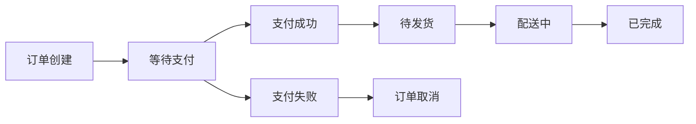
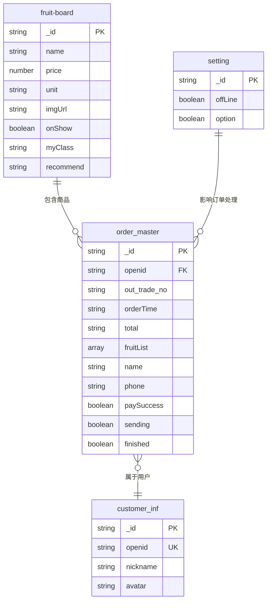

# 水果商城小程序数据库表结构详解

## 📊 数据库概览

本项目使用微信云开发数据库，共涉及 **6个主要数据集合（表）**，用于管理商品、订单、用户、设置等核心业务数据。

---

## 🍎 1. fruit-board（商品信息表）

### 表用途
存储所有水果商品的基本信息，是商城的核心商品数据表。

### 字段结构

| 字段名 | 数据类型 | 必填 | 描述 | 示例值 |
|--------|----------|------|------|--------|
| **_id** | String | ✅ | 商品唯一标识（系统自动生成） | `60f1b2c3d4e5f6789abc123` |
| **name** | String | ✅ | 商品名称 | `"红富士苹果"` |
| **price** | Number/String | ✅ | 商品价格（元） | `8.99` |
| **unit** | String | ✅ | 计量单位 | `"斤"`, `"盒"`, `"个"` |
| **imgUrl** | String | ✅ | 商品图片链接 | `"https://img.alicdn.com/..."` |
| **detail** | String | ❌ | 商品详细描述 | `"新鲜甜脆的红富士苹果"` |
| **fruitId** | String | ❌ | 自定义商品ID | `"apple_001"` |
| **iLike** | String/Number | ❌ | 点赞数 | `"128"` |
| **myClass** | String/Number | ❌ | 商品分类标识 | `"1"` (今日特惠) |
| **onShow** | Boolean | ✅ | 是否在前台展示 | `true` |
| **purchaseFreq** | String/Number | ❌ | 购买次数/销量 | `"56"` |
| **service** | String | ❌ | 售后服务描述 | `"7天无理由退换"` |
| **recommend** | String | ❌ | 是否推荐 | `"1"` (店主推荐) |
| **category** | String | ❌ | 商品类别 | `"苹果"`, `"香蕉"` |
| **stock** | Number | ❌ | 库存数量 | `100` |
| **time** | String | ❌ | 上架时间 | `"2024-01-15"` |

### 业务逻辑

#### 商品分类（myClass）
```javascript
// 分类标识对应关系
const categories = {
  '0': '美味鲜果',    // 全部商品
  '1': '今日特惠',    // 特价商品
  '2': '新鲜上架',    // 新品
  '3': '店主推荐'     // 推荐商品（recommend: '1'）
}
```

#### 数据操作示例
```javascript
// 查询所有在售商品
app.getInfoWhere('fruit-board', { onShow: true }, callback)

// 查询特惠商品
app.getInfoWhere('fruit-board', { myClass: '1' }, callback)

// 查询推荐商品
app.getInfoWhere('fruit-board', { recommend: '1' }, callback)
```

---

## 📋 2. order_master（订单主表）

### 表用途
存储用户订单的完整信息，包括商品清单、地址、支付状态、配送状态等。

### 字段结构

| 字段名 | 数据类型 | 必填 | 描述 | 示例值 |
|--------|----------|------|------|--------|
| **_id** | String | ✅ | 订单唯一标识（系统生成） | `60f1b2c3d4e5f6789def456` |
| **openid** | String | ✅ | 用户微信openId | `"onKwC5ZT_bj3UX10GrLGW3y-o4cY"` |
| **out_trade_no** | String | ✅ | 商户订单号（支付用） | `"20240115143025123456"` |
| **orderTime** | String | ✅ | 订单创建时间 | `"2024-01-15 14:30:25"` |
| **total** | String/Number | ✅ | 订单总金额（元） | `"25.99"` |
| **fruitList** | Array | ✅ | 商品清单 | `[["苹果", 2, "8.99"], ...]` |

#### 用户信息字段
| 字段名 | 数据类型 | 必填 | 描述 | 示例值 |
|--------|----------|------|------|--------|
| **name** | String | ✅ | 收货人姓名 | `"张三"` |
| **phone** | String | ✅ | 收货人手机号 | `"13800138000"` |
| **schoolName** | String | ✅ | 学校名称 | `"交大"` |
| **addressItem** | String | ✅ | 地址类型 | `"宿舍楼"`, `"学院"` |
| **detail** | String | ❌ | 详细地址 | `"1号楼101室"` |
| **message** | String | ❌ | 配送备注 | `"请放在门口"` |

#### 订单状态字段
| 字段名 | 数据类型 | 必填 | 描述 | 示例值 |
|--------|----------|------|------|--------|
| **orderSuccess** | Boolean | ✅ | 订单创建成功 | `true` |
| **paySuccess** | Boolean | ✅ | 支付成功状态 | `true` |
| **payTime** | String | ❌ | 支付完成时间 | `"2024-01-15 14:32:10"` |
| **sending** | Boolean | ❌ | 配送中状态 | `true` |
| **sendingTime** | String | ❌ | 发货时间 | `"2024-01-15 15:00:00"` |
| **finished** | Boolean | ❌ | 已完成状态 | `true` |
| **finishedTime** | String | ❌ | 完成时间 | `"2024-01-15 16:30:00"` |

### 订单状态流转



#### 状态判断逻辑
```javascript
// 订单状态判断
function getOrderStatus(order) {
  if (!order.paySuccess) return '待支付'
  if (!order.sending) return '待发货'
  if (!order.finished) return '配送中'
  return '已完成'
}
```

### fruitList 数组结构
```javascript
// fruitList 数组格式
[
  ["商品名称", 数量, "单价"],
  ["红富士苹果", 2, "8.99"],
  ["脐橙", 1, "7.80"]
]

// 或者对象格式（新版本）
[
  {
    name: "红富士苹果",
    price: 8.99,
    num: 2,
    unit: "斤",
    imgUrl: "https://..."
  }
]
```

---

## ⚙️ 3. setting（系统设置表）

### 表用途
存储系统全局配置信息，如维护状态、营业开关等。

### 字段结构

| 字段名 | 数据类型 | 必填 | 描述 | 示例值 |
|--------|----------|------|------|--------|
| **_id** | String | ✅ | 设置项唯一标识 | `"system_config"` |
| **offLine** | Boolean | ✅ | 系统维护状态 | `false` |
| **option** | Boolean | ❌ | 当前营业状态 | `true` |

### 使用场景
```javascript
// 检查系统是否维护中
app.getInfoFromSet('setting', {}, (res) => {
  if (res.data[0].offLine) {
    wx.showModal({
      title: '系统维护',
      content: '系统正在维护中，请稍后再试'
    })
  }
})
```

---

## 👥 4. customer_inf（客户信息表）

### 表用途
存储用户的基本信息和偏好设置（根据README显示，但代码中未见具体使用）。

### 推测字段结构

| 字段名 | 数据类型 | 描述 | 示例值 |
|--------|----------|------|--------|
| **_id** | String | 用户记录ID | `"user_001"` |
| **openid** | String | 用户微信openId | `"onKwC5ZT_bj3UX..."` |
| **nickname** | String | 用户昵称 | `"张三"` |
| **avatar** | String | 用户头像 | `"https://..."` |
| **createTime** | String | 注册时间 | `"2024-01-15"` |

---

## 🏪 5. fruitStore（商店信息表）

### 表用途
存储商店的基本信息（根据README显示）。

### 字段结构

| 字段名 | 数据类型 | 描述 | 示例值 |
|--------|----------|------|--------|
| **name** | String | 商店名称 | `"新鲜水果店"` |

---

## 📝 6. send_form（配送表单表）

### 表用途
可能用于存储配送相关的表单信息（根据README显示，但代码中未见具体使用）。

---

## 🔄 数据库操作模式

### 1. 直接数据库操作（小程序端）

#### 常用操作方法（app.js中定义）
```javascript
// 添加数据
app.addRowToSet(setName, infoObject, callback)

// 查询数据
app.getInfoFromSet(setName, selectConditionSet, callback)

// 条件查询
app.getInfoWhere(setName, ruleObj, callback)

// 排序查询
app.getInfoByOrder(setName, orderField, orderType, callback)

// 删除数据
app.deleteRowFromSet(setName, fruitId, callback)

// 更新数据
app.updateInfo(setName, _id, updateObj, callback)
```

#### 实际使用示例
```javascript
// 查询商品
app.getInfoWhere('fruit-board', { onShow: true }, (res) => {
  console.log('商品列表:', res.data)
})

// 查询用户订单
app.getInfoWhere('order_master', { openid: userOpenId }, (res) => {
  console.log('用户订单:', res.data)
})

// 更新订单状态
app.updateInfo('order_master', orderId, {
  sending: true,
  sendingTime: new Date().toLocaleString()
}, (res) => {
  console.log('发货成功')
})
```

### 2. 云函数操作

主要用于需要服务端权限的操作：
- 获取用户openId（`add`云函数）
- 微信支付（`pay`云函数）
- 获取IP地址（`getIP`云函数）

---

## 📊 数据关系图



---

## 🎯 核心业务流程

### 1. 商品展示流程
```
fruit-board(onShow: true) → 首页商品列表 → 商品详情 → 加入购物车
```

### 2. 订单处理流程
```
购物车 → 创建订单(order_master) → 微信支付 → 更新支付状态 → 商家发货 → 更新配送状态 → 订单完成
```

### 3. 后台管理流程
```
管理员登录 → 查询订单列表 → 订单发货 → 状态更新 → 蓝牙打印小票
```

---

## 💡 数据库设计特点

### 优点
1. **结构简单**：表结构清晰，易于理解和维护
2. **状态完整**：订单状态流转完整，支持全流程跟踪
3. **扩展性好**：字段设计考虑了未来扩展需求
4. **微信生态**：完美适配微信小程序云开发

### 可优化点
1. **数据规范化**：部分字段类型不统一（String/Number混用）
2. **索引优化**：可以为常用查询字段添加索引
3. **数据验证**：缺少字段长度和格式验证
4. **关联查询**：可以考虑使用聚合查询优化性能

---

## 📝 总结

本项目数据库设计简洁实用，核心表包括：

1. **fruit-board** - 商品信息的核心存储
2. **order_master** - 订单全生命周期管理  
3. **setting** - 系统配置管理
4. **customer_inf** - 用户信息存储
5. **fruitStore** - 商店信息
6. **send_form** - 配送表单

整体架构支持完整的电商业务流程，从商品展示到订单完成，数据流转清晰，状态管理完善。配合微信云开发的便利性，为小程序提供了稳定可靠的数据支撑。